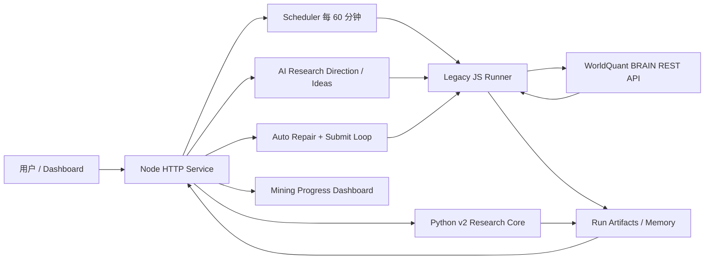
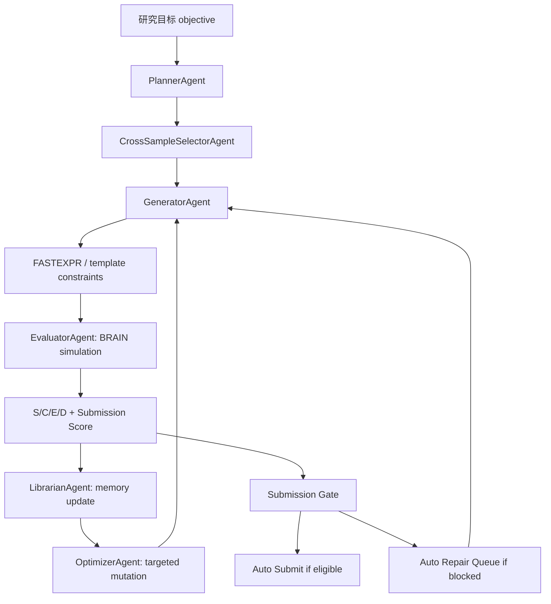
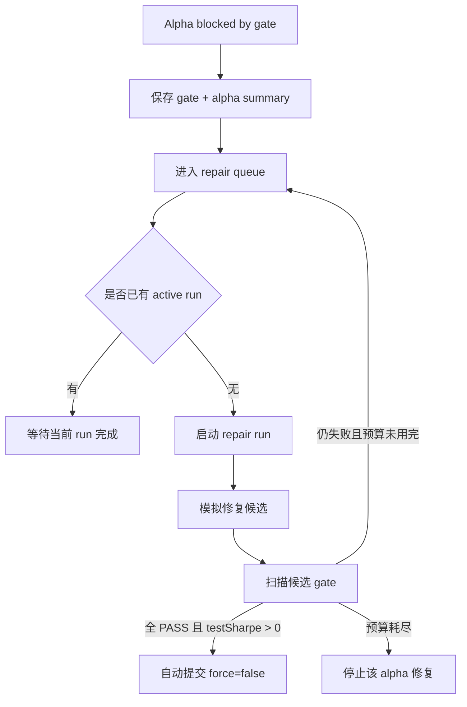

# QuantBrain App 架构与因子挖掘流程总结

生成日期：2026-04-13

本文档总结当前 QuantBrain 应用的线上架构、自动化因子挖掘流程、提交闸门、自动修复-重试-提交闭环，以及 regular-tier WorldQuant BRAIN 账号下的关键限制。

## 1. 当前系统定位

QuantBrain 是一个部署在 Railway 上的 WorldQuant BRAIN 自动化因子挖掘与监控系统。它的目标不是绕过 BRAIN 官方提交规则，而是在官方 REST API 能力范围内，把“研究方向生成、候选因子模拟、失败原因读取、定向修复、重试、合格后提交”做成可观测的自动化闭环。

系统当前采用混合架构：

- Node Dashboard / Orchestrator：负责 HTTP API、dashboard、鉴权、scheduler、run 管理、BRAIN 提交闸门、自动修复队列与自动提交。
- Legacy JS Alpha Runner：负责当前线上 live 因子挖掘、BRAIN 模拟、train/test/checks 读取、scorecard、trajectory memory 与 targeted mutation。
- Python v2 Research Core：负责 v2.1 研究核心 scaffold，包括表达式校验、知识库、LLM cache、统计模块、BRAIN backtester 抽象、PnL 池、组合优化等；由于 regular-tier 当前没有 daily PnL，live 评估路径采用降级策略。
- Railway Volume：保存 runs、ideas、auto-loop 状态、memory、summary、batch、progress 等持久化产物。

当前线上默认：

- Scheduler 引擎：`legacy-js`
- Scheduler 间隔：60 分钟
- 自动修复：开启
- 自动提交：开启，但只允许非强制 gate 通过后提交
- Python v2：可手动选择，用于生成/研究/降级评估，不作为当前自动 live loop 默认引擎

## 2. 高层架构图

## 3. 主要模块职责

### Node HTTP Service

入口文件：`service/server.mjs`

职责：

- 提供 dashboard 页面。
- 提供受 `ADMIN_TOKEN` 保护的 API。
- 管理 `/runs`、`/scheduler`、`/ideas`、`/alphas/:id/submit`、`/auto-loop`。
- 启动子进程运行 `legacy-js` 或 `python-v2` 引擎。
- 读取 run artifacts，展示 progress tail。
- 持久化 `auto-loop-state.json`。
- 在 run 完成后扫描候选 Alpha，决定自动提交或进入修复队列。

### Legacy JS Runner

入口文件：`service/agentic_alpha_lab.mjs`

核心库：`service/agentic_alpha_library.mjs`

职责：

- 将 objective 转换为 plan。
- 从模板库与 memory 中生成多样化候选。
- 向 BRAIN `/simulations` 提交模拟。
- 轮询 `/simulations/{id}`，完成后读取 `/alphas/{id}`。
- 提取 IS、train、test、turnover、checks。
- 计算 scorecard：Strength、Consistency、Efficiency、Diversity、Submission。
- 写入 `batch-round-N.json`、`memory.json`、`summary.json`。
- 支持 `--repair-context <path>`，基于 gate 失败原因生成定向修复候选。

### Python v2 Research Core

入口文件：`alpha_miner/main.py`

职责：

- 表达式校验：白名单算子/字段、复杂度、括号、深度、虚构算子检测。
- 知识库：WQ101 作为 negative examples，不作为模仿模板。
- LLM cache：按完整规范化 request payload 做 SHA256 缓存。
- 统计模块：DSR、PBO、purged K-fold 等。
- BRAIN backtester 抽象：支持提交、poll、alpha dump、BRAIN check 代理。
- AlphaPool：真实 PnL 可用时做 Pearson 正交；无 PnL 时只允许弱代理。
- PortfolioOptimizer：真实 PnL 可用时可做 MVO；无 PnL 时阻断。

由于 Phase 0 探测结论为 Case C，regular-tier 下不能获取可靠 daily PnL，因此 Python v2 live 评估不会伪造 PnL，不会用 aggregate metrics 假装 DSR/MVO 可用。

## 4. 数据与 Artifact 结构

每个 run 会写入 Railway volume 的 run 目录。

常见 artifacts：

- `summary.json`：run 摘要、top candidates 或 Python v2 summary。
- `memory.json`：effective pool、deprecated pool、trajectories、objective history。
- `batch-round-N.json`：每轮候选、BRAIN 返回、scorecard、metrics、checks。
- `generated-batch.json`：generate 模式下的候选批次。
- `progress.jsonl`：Python v2 进度流或 run 进度尾部展示。
- `repair-context.json`：自动修复 run 的输入上下文。
- `auto-loop-state.json`：自动修复队列、active repair、recent submissions、events。

不保存内容：

- OpenAI API key
- WorldQuant BRAIN 密码
- Dashboard token
- 任何需要保密的凭证

## 5. 因子挖掘 Agent 流程

当前 live 挖掘流程使用 legacy JS agent graph：

Agent 设计借鉴：

- FAMA：跨样本多样性，避免同质化公式。
- Alpha-GPT：把自然语言方向编译成结构化研究目标，而不是盲目生成公式。
- Chain-of-Alpha：生成链和优化链分离，按多维反馈修复。
- QuantaAlpha：保留 hypothesis-expression-trajectory 轨迹，修复时不随意偏离经济假设。

## 6. 自动修复-重试-提交闭环

自动闭环由 Node orchestrator 控制，而不是由 runner 直接提交。

触发方式：

- 用户点击 Submit 但 gate 拦截。
- evaluate/loop run 完成后，系统扫描候选并发现未达提交条件。

处理流程：

固定预算：

- 每个被拦截 Alpha 最多 5 轮修复。
- 每轮最多 5 个修复候选。
- 同一时间只启动一个 repair run，避免并发消耗过多 BRAIN 模拟额度。

自动提交规则：

- 禁止 `force:true`。
- 只提交 `status=UNSUBMITTED` 的 Alpha。
- visible IS checks 必须全部 `PASS`。
- `testSharpe` 必须大于 0。
- 任何 `FAIL` 或 `PENDING` 都不会被强制提交。

## 7. Gate 失败原因到修复策略的映射

`LOW_SHARPE` / `LOW_FITNESS`

- 保留经济假设，增强信号强度。
- 对盈利质量类信号，优先尝试 peer-relative、denominator swap、strength blend、质量改善而非质量水平。
- 示例方向：从 `ts_rank(operating_income / assets, 252)` 转向 `rank(ts_delta(operating_income / assets, 252))` 或行业内 peer blend。

`HIGH_TURNOVER`

- 提高 decay。
- 拉长时间窗口。
- 用更慢的 `ts_mean` 或 smoother transform。
- 减少跳变条件。

`LOW_SUB_UNIVERSE_SHARPE`

- 使用 `group_rank`、`industry`、`subindustry`。
- 降低小盘、低流动性尾部暴露。
- 避免只在整体 universe 有效但在子 universe 崩溃的结构。

`CONCENTRATED_WEIGHT`

- 增加 `rank` 或 `group_rank`。
- 避免 raw ratio 造成权重集中。
- 保持 truncation-safe 的表达式结构。

`SELF_CORRELATION:PENDING`

- 如果只有 pending，等待后续重新检查。
- 如果同时存在 Sharpe/Fitness 失败，则直接按强度和概念差异修复。

`SELF_CORRELATION:FAIL`

- 不做 cosmetic mutation。
- 必须改变机制、数据族、horizon、group 维度或核心表达方式。
- 目标是概念层面的差异，而不是换窗口参数。

`testSharpe <= 0`

- 不提交。
- 优先做 robustness repair，例如 peer-relative、慢窗口、减少 IS overfit。

## 8. Dashboard 展示逻辑

Dashboard 当前从 `Top Candidates` 改为 `Mining Progress`。

展示内容：

- auto repair 是否开启。
- auto submit 是否开启。
- repair engine。
- repair queue 长度。
- active repair 的 alphaId、表达式、failed checks、repair depth、next action。
- queued repair 的状态。
- recent submissions。
- auto-loop events。
- latest run progress tail。
- Next Run 的完整本地时间和剩余分钟。

这样设计的原因是：用户当前更关心系统正在挖哪个因子、为什么被拦截、下一步如何修复，而不是单纯看历史候选排名。

## 9. Public API 总结

`GET /health`

- 返回服务状态、scheduler 状态、openAI 配置状态、runs/ideas 路径。

`GET /runs`

- 返回 active runs、recent runs、stored runs、scheduler、autoLoop。

`POST /runs`

- 手动启动 run。
- 支持 `engine: "legacy-js" | "python-v2"`。
- 支持 `mode: "generate" | "evaluate" | "loop"`。

`GET /scheduler`

- 返回 scheduler 当前状态。

`POST /scheduler`

- 更新 scheduler 开关、引擎、模式、间隔、objective、rounds、batchSize。

`POST /ideas/analyze`

- 使用 OpenAI 或 fallback 规则将自然语言想法改写为结构化研究方向。

`POST /ideas/:ideaId/run`

- 从 AI 草案启动 run。

`POST /alphas/:alphaId/submit`

- 读取 BRAIN alpha detail。
- 运行提交 gate。
- gate 通过才提交。
- gate 失败时返回 422，并自动进入 repair queue。

`GET /auto-loop`

- 返回自动修复队列、active repair、recent submissions、events、配置。

## 10. 线上关键环境变量

核心运行：

- `RUNS_DIR=/app/data/runs`
- `IDEAS_DIR=/app/data/ideas`
- `AUTO_RUN_ENABLED=true`
- `AUTO_RUN_MODE=loop`
- `AUTO_RUN_INTERVAL_MINUTES=60`
- `ALPHA_MINER_ENGINE=legacy-js`

自动修复与提交：

- `AUTO_REPAIR_ENABLED=true`
- `AUTO_REPAIR_ENGINE=legacy-js`
- `AUTO_REPAIR_MAX_ROUNDS=5`
- `AUTO_REPAIR_BATCH_SIZE=5`
- `AUTO_SUBMIT_ENABLED=true`

AI idea analyzer：

- `OPENAI_IDEA_MODEL=gpt-5.4-mini`
- `OPENAI_API_KEY` 只存在服务端环境变量中，不进入前端和 artifacts。

BRAIN 凭证：

- `WQB_EMAIL`
- `WQB_PASSWORD`

## 11. regular-tier PnL 限制与当前应对

Phase 0 探测结论：

- BRAIN regular-tier API 会忽略用户传入的 `startDate/endDate`，返回平台固定 IS 窗口。
- 没有发现 regular-tier 可用的 daily PnL 序列端点。
- `/alphas/{id}` 返回 aggregate metrics，但 `alpha.is.pnl` 是聚合值，不是日度序列。

因此系统当前原则：

- 不伪造 daily PnL。
- 不把 aggregate PnL 当作序列。
- 不在无真实 PnL 情况下运行 PnL Pearson、DSR、MVO 的 live 决策。
- 使用 BRAIN 自带 checks 和 train/test metrics 作为 regular-tier 下的主要 live feedback。
- Python v2 的 PnL 原生路径保持阻断或降级，直到拿到真实 daily PnL 来源。

## 12. 质量与安全原则

提交安全：

- 永远不使用 `force:true` 自动提交。
- gate 不全 PASS 就不提交。
- `testSharpe <= 0` 不提交。
- `SELF_CORRELATION:PENDING` 不视为通过。

挖掘质量：

- 不只优化 IS Sharpe。
- 同时考虑 Fitness、turnover、sub-universe、self-correlation、train/test stability。
- mutation 必须针对失败原因。
- 记录 hypothesis 到 expression 的轨迹。
- 避免同一公式的窗口参数微调导致同质化。

额度控制：

- 同一时间只运行一个 repair run。
- 每个 blocked alpha 有 5 轮 x 5 候选上限。
- active run 存在时新 repair 进入队列，避免并发爆量。

## 13. 当前推荐使用方式

日常自动运行：

- 保持 scheduler 开启。
- 默认每 60 分钟运行一次 legacy-js loop。
- 系统自动读取结果并修复拦截候选。

手动研究方向输入：

- 在 Dashboard 的 AI Research Direction 输入自然语言想法。
- Analyze 后检查草案。
- 选择 `legacy-js` 跑 live evaluate/loop，或选择 `python-v2` 做生成/研究。

查看当前状态：

- Dashboard 查看 `Mining Progress`。
- API 查看 `/auto-loop`。
- BRAIN 平台中查看 alphaId 对应模拟和提交状态。

## 14. 后续可升级方向

短期：

- 为 auto-loop events 增加更细的状态分类，例如 `waiting-check`, `repair-budget-exhausted`, `auto-submit-succeeded`。
- 将 repair queue 增加手动暂停/清空/重试按钮。
- 将失败样本自动加入 deprecated pool，降低重复生成概率。

中期：

- 增加更多数据族模板，避免 fundamental-quality 过度集中。
- 将 AI idea analyzer 输出直接转为更多结构化 constraints。
- 增加“概念多样性覆盖率”面板。

长期：

- 如果获得 consultant tier 或找到官方可用 daily PnL 路径，再启用 Python v2 的 DSR、PnL Pearson、MVO 组合优化主路径。
- 在不违反平台规则的前提下，用本地近似 backtester 做预筛选，但仍以 BRAIN 官方模拟和提交 checks 为最终标准。

